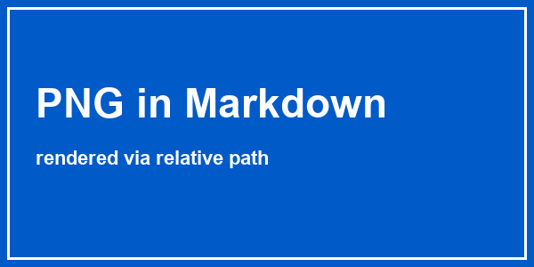
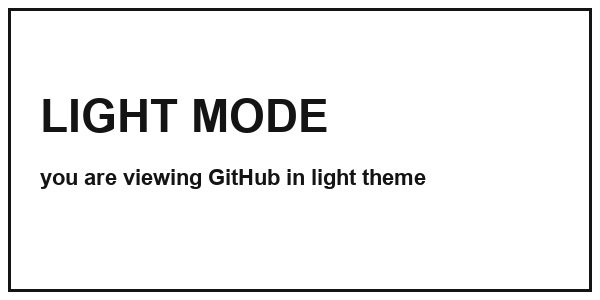
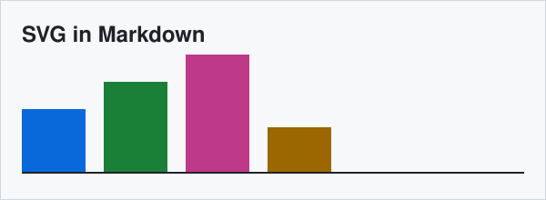

# Markdown 裡的 HTML — 渲染實測

這個檔案是拿來**親眼驗證** GitHub 對 `.md` 裡的 inline HTML 做了什麼。
同一份原始碼，點 **Raw** 看寫了什麼、回到這頁看渲染成什麼。

---

## 1. 置中 + 圖片寬度

<div align="center">
  <h3>置中標題</h3>
  
  <br>
  <sub>上面這行是 <code>&lt;sub&gt;</code>：相對路徑的 PNG</sub>
</div>

---

## 2. 折疊區塊（`<details>`）

<details>
<summary><b>點我展開 — 裡面照樣能寫 markdown</b></summary>

空一行之後，markdown 就會正常解析：

1. 第一步
2. 第二步

| 表格 | 也可以 |
|---|---|
| a | b |

```python
print("連 code block 都行")
```

</details>

<details>
<summary>沒有空行的話會怎樣</summary>
**這行前後沒空行**，所以星號會原樣印出來
</details>

---

## 3. 複雜表格（markdown 表格做不到的合併儲存格）

<table>
  <tr>
    <th>參數</th><th>值</th><th>說明</th>
  </tr>
  <tr>
    <td rowspan="2"><code>mode</code></td>
    <td align="right"><code>fast</code></td>
    <td>預設</td>
  </tr>
  <tr>
    <td align="right"><code>safe</code></td>
    <td>慢但保險</td>
  </tr>
  <tr>
    <td colspan="3" align="center"><i>colspan 跨三欄</i></td>
  </tr>
</table>

---

## 4. 深色 / 淺色自動換圖（`<picture>`）

> 切換 GitHub 右上角的主題（Settings → Appearance），下面這張圖會跟著換。

<picture>
  <source media="(prefers-color-scheme: dark)" srcset="docs/dark.png">
  
</picture>

---

## 5. 圖片來源的四種寫法

| # | 寫法 | 結果 |
|---|---|---|
| A | 相對路徑 PNG | 見下 |
| B | 相對路徑 SVG | 見下 |
| C | `data:` base64 內嵌 | 見下 |
| D | 外部 https 網址 | 見下 |

**A. 相對路徑 PNG**


**B. 相對路徑 SVG**



**C. data: base64 內嵌**


**D. 外部 https**


---

## 6. 這些會被砍掉（安全性 sanitize）

<p style="color:red; font-size:30px">我寫了 style="color:red"，但你看到的是黑色正常大小</p>

<button onclick="alert('hi')">我是 button，但只會剩文字</button>

<form>
  <input type="text" placeholder="輸入框">
  <select><option>下拉選單</option></select>
</form>

<script>alert('xss')</script>
<style>body { background: red }</style>
<iframe src="https://example.com" width="400" height="200"></iframe>

<a href="https://example.com" target="_blank">正常連結（target 會被拔掉）</a>
<a href="javascript:alert(1)">javascript: 連結（整個 a 被砍）</a>

---

## 7. 零碎但好用的

水 H<sub>2</sub>O、平方 x<sup>2</sup>、快捷鍵 <kbd>Ctrl</kbd> + <kbd>C</kbd>

<div align="right"><i>靠右對齊</i></div>

<hr>

<blockquote>
  <p>用 HTML 寫的引言</p>
</blockquote>
